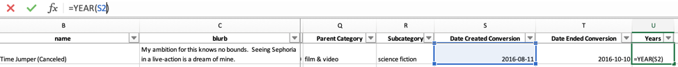
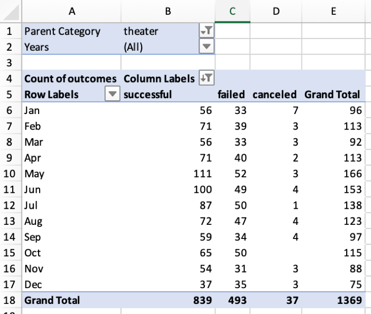
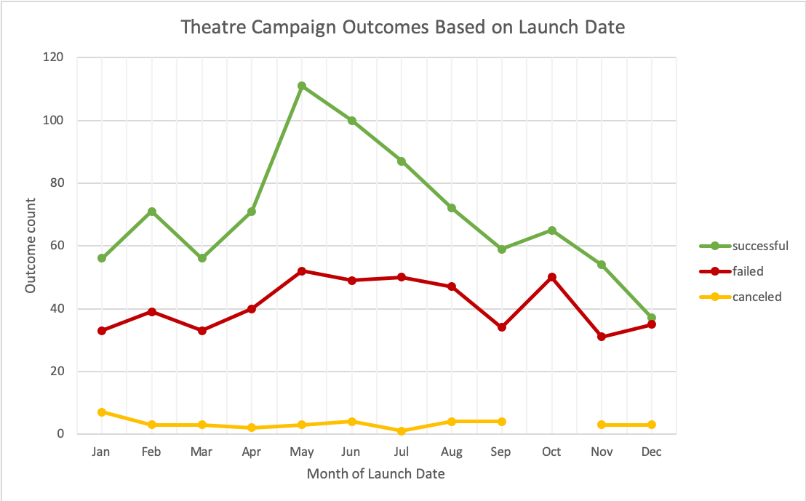
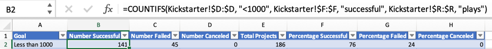
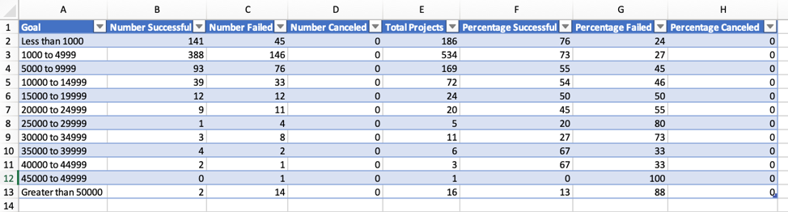
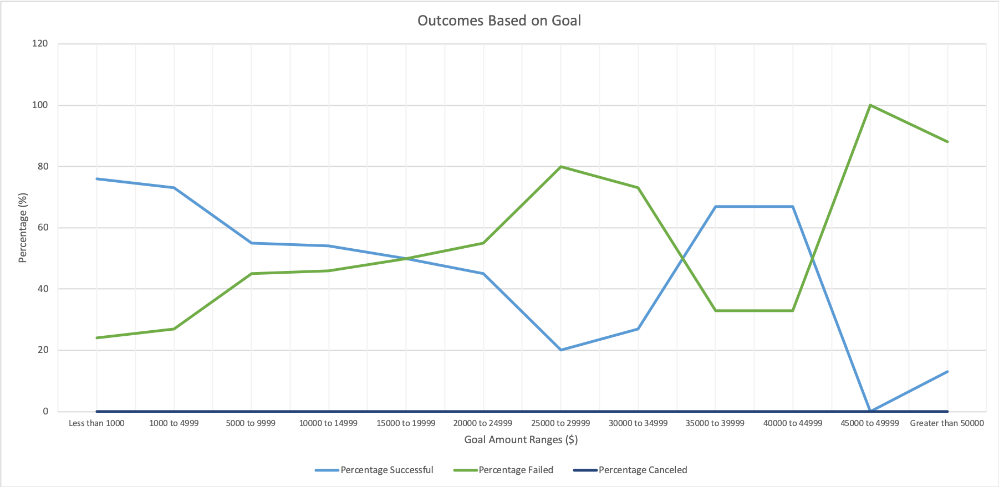

# Kickstarter Theatre Campaign Analysis

#### _**Module 1 Assignment for the University of Toronto's School of Continuing Studies (SCS) Data Analytics Boot Camp**_

## Overview of Project

### Purpose

The purpose of this analysis is to uncover trends in current Kickstarter data and identify factors of a successful campaign in the hopes of assisting our client, Louise, an aspiring playwright. After failing to meet her funding goal for her play "Fever" by a small margin, our client is now concerned with how crowdfunding campaigns under the "Theatre" parent category fare based on their launch date and funding goals. This report will summarize our findings and provide suggestions to improve our client's future campaign planning. 

## Analysis and Challenges

### Analysis of Outcomes Based on Launch Date

In this analysis, we visualized campaign outcomes ("successful," "failed," and "cancelled") based on their launch date using a line chart derived from a PivotTable. 

The original dataset provided us with the length of each campaign with its start and end dates. We want to focus on the year of the launch dates, so we created a new column in our spreadsheet, "Years," and used the formula **=YEAR()** to extract the year from data in the "Date Created Conversion" column. The below screenshot provides an example of the formula in action. 

Once we isolated the years, we generated a PivotTable using the following fields:

- Filtered for "Parent Category" and "Years" (to specifically focus on "Theatre" campaigns which are of our client's interest)
- "Outcomes" in Columns
- "Dated Created Conversion" in Rows (by filtering for "Years," the months of the year appear in our table)
- "Count of Outcomes" as our Values

The below PivotTable is the result of the above fields, filtering for the "Theatre" parent category and organizing the columns in descending order:

We want to look at the timeline of how the "Theatre" campaigns fared over the year, so we created the below line graph derived from our PivotTable:

### Analysis of Outcomes Based on Goals

In this analysis, we visualized how funding goals affected the outcomes of campaigns that fell under the "Plays" subcategory. 

First, we designated the funding goal ranges that we wanted to compare. Using these ranges, we used the formula **=COUNTIFS()** to count the number of campaigns that met multiple conditions that would help in our analysis. In each count, the campaign had to meet the following conditions:

1. The campaign had to fall under the specific funding goal range that we were counting for
2. The campaign had to fall under the specific outcome that we were counting for ("successful," "failed," or "cancelled")
3. The campaign had to fall under the "Plays" subcategory

Below is an example of the **=COUNTIFS()** formula used to count the number of successful campaigns with a funding goal range of less than $1000:

After performing the counts, we converted them into a percentage of total projects in each funding goal range that were "successful," "failed," or "cancelled." The below table summarizes the above analysis:

To visualize the results, we created the below line graph to see how the percentage of outcomes varied as the funding goal range increased:

### Challenges and Difficulties Encountered

I faced a challenge in the second part of our analysis, specifically using the **=COUNTIFS()** formula to count the number of campaigns that met the three conditions. Initially, I found the calculation process very taxing, as I calculated each formula individually to avoid syntax errors. 

After completing the "Number Successful" column manually, I reviewed my class notes. I realized that I could copy and paste the formula down the column by double-clicking on the crosshair of the first cell containing the formula. This solution is possible because two out of the three conditions are the same down each column: the "plays" and the specific outcome. The only condition requiring manual entry would be the funding goal range, but that would only be one condition to manipulate and not three, resulting in syntax errors if not entered correctly.

## Results

### Outcomes Based on Launch Date

From our analysis of Theatre Outcomes by Launch Date, we can conclude that the success of these campaigns peaks when launched in May and steadily declines as the year progresses, with December having the lowest number of successful campaigns launched in that month. Perhaps, this trend is a reflection of greater public interest in plays during late spring/summer. 

We can also conclude that the number of failed campaigns follows a similar trend pattern over the year compared to the number of successful campaigns. Although the number of campaigns varies between the two outcomes, with each month having more successful launched campaigns than failed ones, both outcomes experience a similar rise in numbers during early spring, peaking in May and tapering off in the winter months. 

Although both outcomes follow similar trends throughout the year, the number of successful campaigns at any month is still greater than the number of failed campaigns, suggesting that launch date is not the sole factor in determining a campaign's success. If launch date were the sole factor, then the successful and failed campaigns would not follow such similar trends. 

### Outcomes Based on Goals

From our analysis of outcomes based on goals, we can conclude that campaigns with funding goals under $19999 had the greatest success than campaigns with higher goals. We see the greatest percentages of successful campaigns paired with the lowest percentages of failed campaigns in this range. 

### Limitations and Recommendations

A possible limitation in the dataset used for our analysis could be that we did not account for different countries. Our dataset consisted of campaigns from multiple countries that may have varied public interest in theatres or plays, potentially skewing these campaigns' success or failure rates. A possible recommendation to further improve our analysis would be to create a PivotTable that filtered for "Country" to create multiple line graphs visualizing how funding goals affected the success of campaigns for plays.

