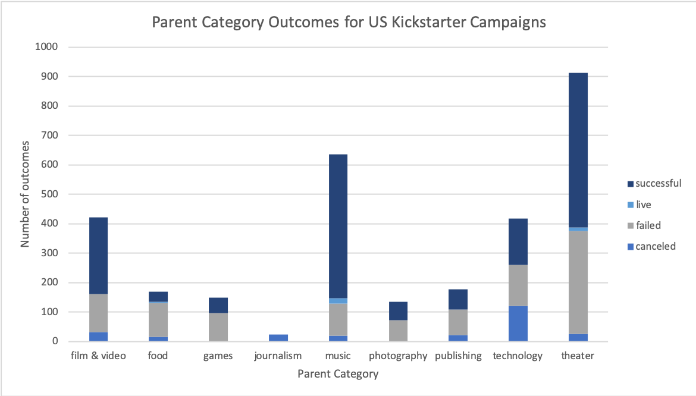
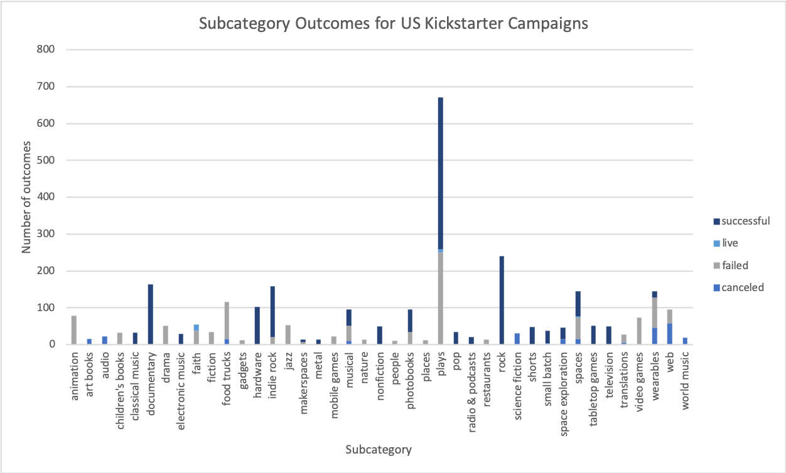
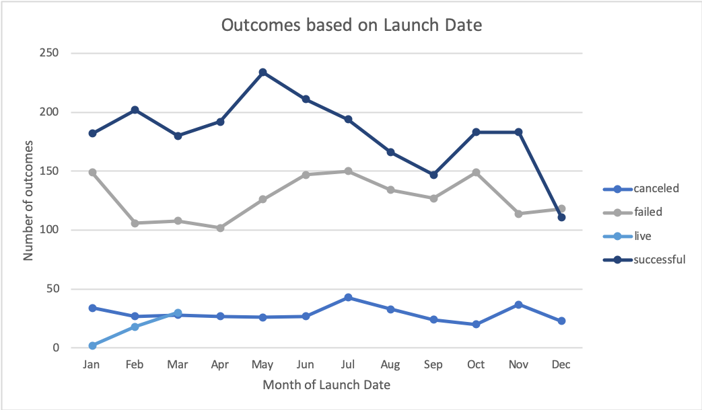

# An Analysis of Kickstarter Campaigns

The purpose of this analysis is to uncover trends in current Kickstarter campaign data and identify factors of a successful campaign in the hopes of assisting our client who wants to create a successful crowdfunding campaign to fund her future playwright with an estimated budget of $12,000. 

## Findings and Analysis

### Parent categories and subcategories
Kickstarter campaigns are classified by their parent category. Of all US Kickstarter campaigns, the most successful parent category is "Theatre," with 525 out of 912 (~57%) launched campaigns meeting their funding goals. Despite our client's project falling under the most successful parent category, the fact that 349 out of 912 (~38%) "Theatre" campaigns failed warrants further analysis of other factors that would help our client run a successful campaign. 

Kickstarter campaigns are further classified into subcategories. Our client's project falls under "Plays," one of the three subcategories of the parent category "Theatre." "Plays" is the most successful subcategory of all US Kickstarter campaigns, with 412 out of 671 (~61%) campaigns meeting their funding goals. 

Based on these initial findings, our client has a good chance of running a successful campaign to fund their play. Their campaign would fall under the most successful parent category and subcategory, suggesting that plays receive more funding support from the public and are more likely to succeed to meet the funding goal.

### Launch date of campaign
Kickstarter data provides us with the launch date and deadlines of campaigns hosted on the site. By analyzing campaign outcomes based on their launch date, we can determine the appropriate time for our client to launch their campaign. There is a spike in successful campaigns in June, with success tapering off in the following months. There are spikes in failed campaigns in May and October, which suggests that our client should avoid initiating their campaign in these months and plan for a June launch date. 

By filtering for successful US Kickstarter campaigns under the "Theatre" parent category, we can calculate the average length of time required for these campaigns to meet their funding goals. The average campaign length is 28 days, which would be a reasonable timeline for our client if she launches their campaign in June. 

### Descriptive statistics
The average successful "Theatre" Kickstarter goal is $5049, and the average successful "Theatre" Kickstarter pledge is $5602. These descriptive statistics are concerning, as our client's estimated budget is $12,000. The mean and median pledged amounts for failed campaigns are much lower than the successful campaigns, suggesting more factors involved in their failure. 

## Suggestions for the Client
* Launch the campaign in June
* Plan for a 28-day long campaign
* Aim for a pledge of $5000 
